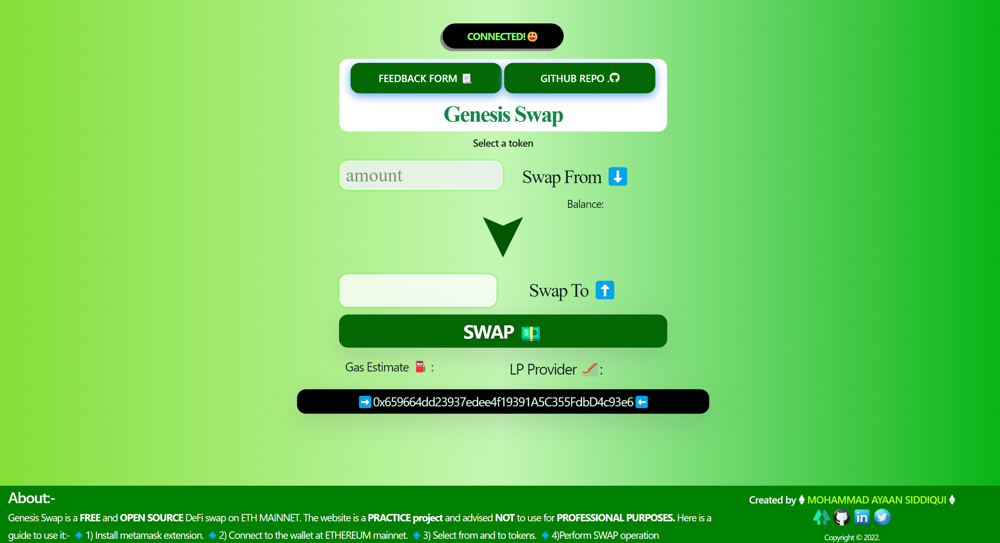
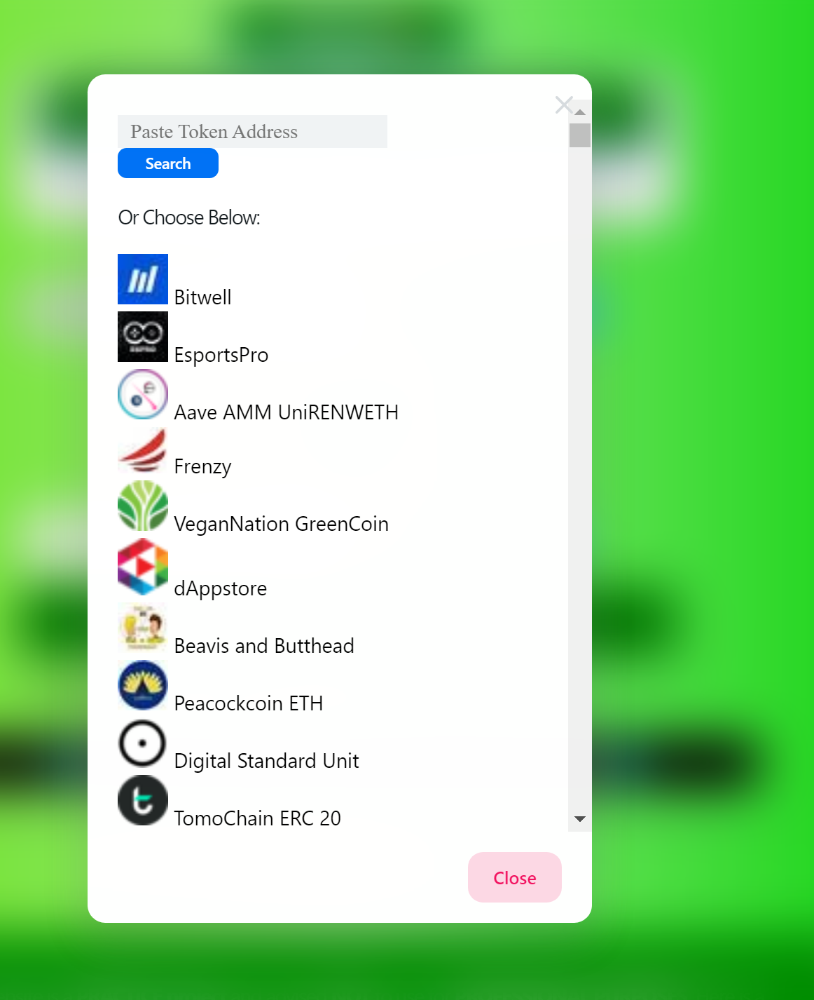
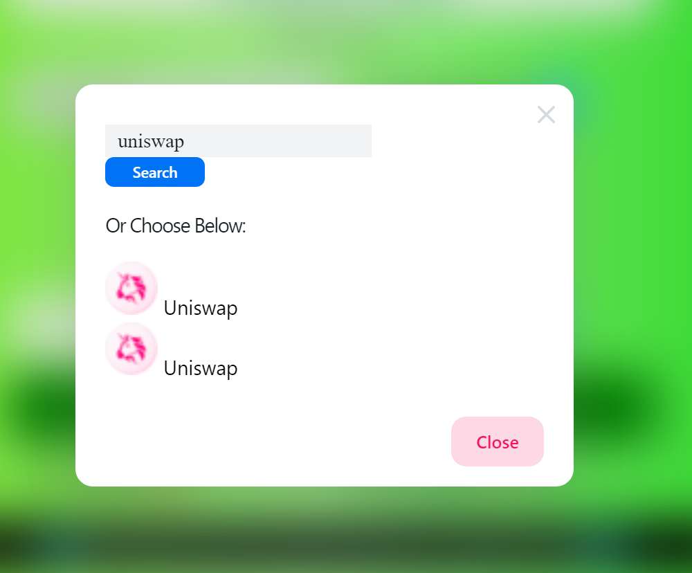
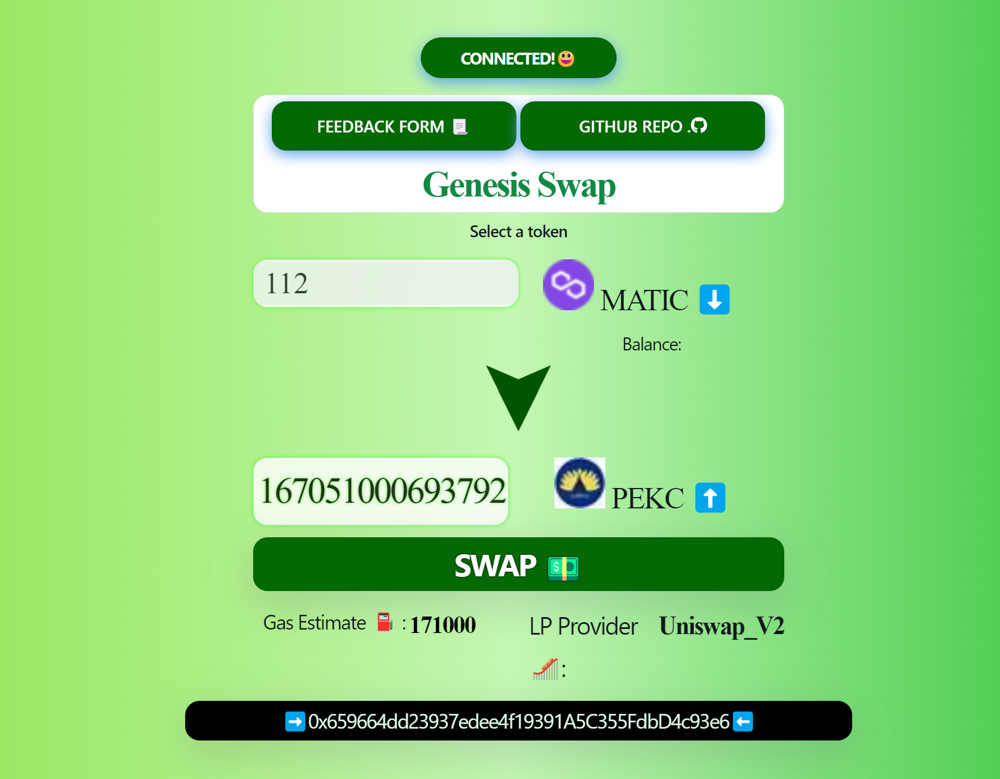

# GENESIS SWAP

**Deployment Link:-https://genesis-swap.vercel.app/**

---

## PREVIEW

---

## Video DEMO:-

[Video Demo of Genesis Swap App](https://www.loom.com/share/33e15b0d2bdf42ea98bcc1a3330fcf76)

---

## About the App

Genesis Swap is a **FREE** and **OPEN SOURCE** defi swap web app built on **Ethereum** Mainnet. The project has been created by **Mohammad Ayaan Siddiqui** and is a PRACTICE project, professional use not advised. The web app comes with **FEEDBACK form** and **GITHUB** source code attached.

---

## TECH STACK

The Tech Stack used in creating this project is:-

1.  [Next.js](https://nextjs.org/)
2.  [Next UI](https://nextui.org/)
3.  [Solidity](https://docs.soliditylang.org/en/v0.8.17/)
4.  [Hardhat](https://hardhat.org/)
5.  [Alchemy SDK](https://www.alchemy.com/sdk)
6.  [0xProtocol](https://protocol.0x.org/en/latest/)
7.  [web3modal](https://web3modal.com/)
8.  [Ethers.js](https://docs.ethers.io/v5/)
9.  [Vercel](https://vercel.com/dashboard)
10. [CoinGecko API](https://www.coingecko.com/en/)
11. [Emojipedia](https://emojipedia.org/)
12. [Icons8](https://icons8.com/)

---

## RUN ON LOCAL MACHINE

Steps to run this project on your local machine:-

1. Clone this repo using

`git clone https://github.com/moayaan1911/genesis-eth-swap`

2. Open the cloned folder

3. Run `yarn` OR `npm i --legacy-peer-deps`

4. Run `yarn start` OR `npm run start`

---

## About the Developer

Hello everyone, myself Mohammad Ayaan Siddiqui from India. I am a Full Stack WEB3 developer and a Certified Ethereum Developer. I talk about WEB3, Cryptocurrencies, Javascript and Python. If you are interested in either of the topics, connect with me below:-

1.  [My Linktree with ALL SOCIALS](https://linktr.ee/ayaaneth)

2.  [Connect on Github](https://github.com/moayaan1911)

3.  [Connect on Linkedin](www.linkedin.com/in/ayaaneth)

4.  [Connect on Twitter](https://www.twitter.com/usdisshitcoin)

5.  [Connect on Telegram](https://t.me/usdisshitcoin)

6.  [Connect on dev.to](https://dev.to/moayaan1911)
